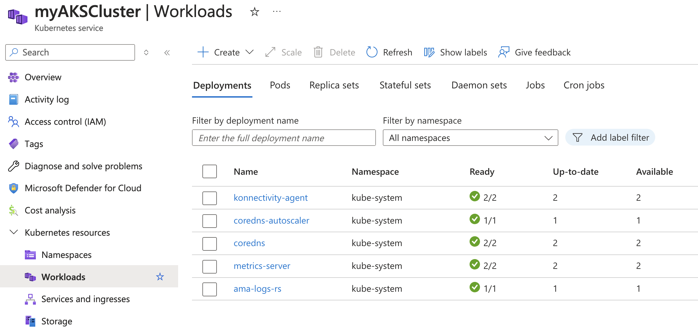
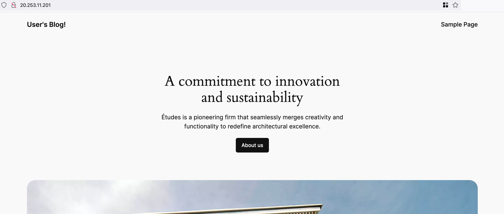
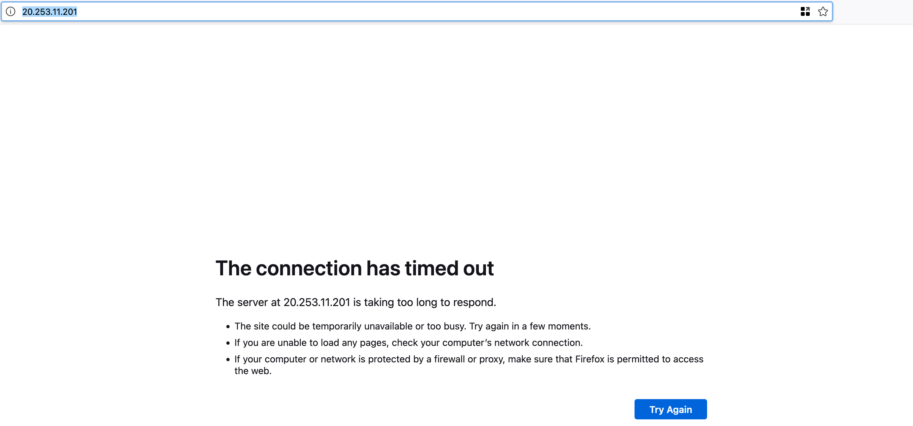
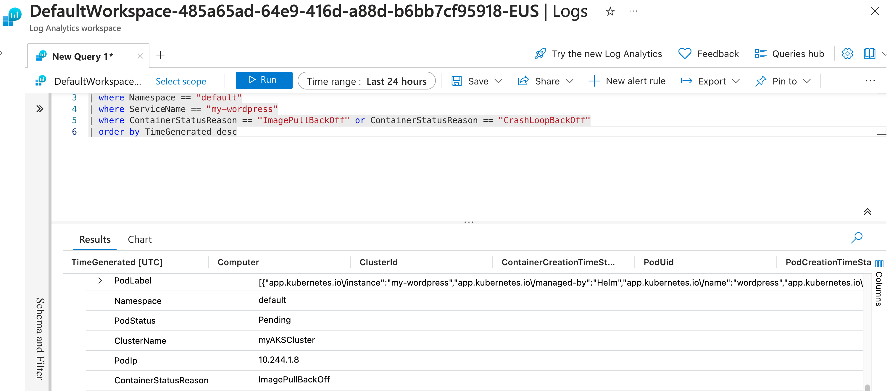

### Part 1: Introduction and Setup for Azure Kubernetes Service (AKS)

#### Introduction

##### **Overview of the Lab Objectives**
- Set up an Azure Kubernetes Service (AKS) cluster using Azure CLI.

##### **Brief on the AKS Architecture**
- **Azure Kubernetes Service (AKS)**: Managed Kubernetes service for deploying, managing, and scaling containerized applications.
- **Azure CLI**: Command-line tool for managing Azure resources.

##### **Tools and Technologies Required**
- **Azure CLI**: Command-line tool for managing Azure resources.
- **Azure Subscription**: Required to create and manage Azure resources.
- **AKS**: Azure service for managing Kubernetes clusters.

#### Environment Setup

##### **Install Azure CLI**
**Azure CLI Installation**
   - If you completed the Key Vault lab, Azure CLI (`az`) should already be installed on your system.
   - If not, follow the instructions from Part 1 of the Key Vault lab to install Azure CLI on your system

##### **Verify Installation**
- Open a terminal or command prompt and run:
  ```bash
  az --version
  ```

- You should see output indicating the installed version of Azure CLI.

##### **Login to Azure and Select Subscription**

```bash
az login
```

- Use the Azure CLI to log in to your Azure account. After logging in, you will see a list of available subscriptions and a prompt to select a subscription. Select the one specified by your instructor.

##### **Verify Current Tenant and Subscription**

```bash
az account show
```

- This command displays the details of the currently selected subscription and tenant. Verify that the correct subscription and tenant are selected.

##### **Install kubectl**
**kubectl Installation**
   - Follow the instructions from the official Kubernetes website to install `kubectl` on your system:
     - [kubectl for Windows](https://kubernetes.io/docs/tasks/tools/install-kubectl-windows/)
     - [kubectl for Mac](https://kubernetes.io/docs/tasks/tools/install-kubectl-macos/)
     - [kubectl for Linux](https://kubernetes.io/docs/tasks/tools/install-kubectl-linux/)

- Verify `kubectl` installation by running:
  ```bash
  kubectl version --client
  ```

- You should see output indicating the installed version of `kubectl`.

##### **Create a Resource Group**  
   - If you completed the Key Vault lab, a resource group (`myResourceGroup`) should already exist.
   - If not, follow the instructions from Part 1 of the Key Vault lab to create a resource group.

#### Create an AKS Cluster

```bash
az aks create \
  --resource-group myResourceGroup \
  --name myAKSCluster \
  --node-count 2 \
  --enable-addons monitoring \
  --generate-ssh-keys
```
- **Note:** This command can take up to 10 minutes to complete.

##### **Authenticate to the AKS Cluster**

```bash
az aks get-credentials --resource-group myResourceGroup --name myAKSCluster
```

- This command configures `kubectl` to use your credentials for the AKS cluster.

##### **List System Pods in the AKS Cluster**

```bash
kubectl get pods --namespace kube-system
```

- This command lists the system pods running in the `kube-system` namespace of the AKS cluster.
- The kube-system namespace is used by Kubernetes to manage system-level components, such as networking and cluster services, including the core DNS, the Kubernetes dashboard, and the API server.

##### **View the AKS Cluster in the Azure Portal**
- Open the [Azure Portal](https://portal.azure.com/).
- Navigate to "Resource groups" in the left-hand menu.
- Select the resource group [`myResourceGroup`].
- Click on the AKS cluster [`myAksCluster`] to view its details.



##### **Familiarize Yourself with the AKS Cluster**
- Take some time to explore the different resources and settings within the AKS cluster. For instance:
  - **Node Pools**: View the nodes that make up the AKS cluster.
  - **Workloads**: Check the deployed workloads, including deployments, pods, and replica sets.
  - **Services and Ingress**: Review the services and ingress controllers that manage network traffic.
  - **Storage**: Examine the storage options, including persistent volume claims and storage classes.
  - **Monitoring**: Explore the monitoring tools and metrics available for the cluster.
  - **Access Control (IAM)**: Review the role-based access control (RBAC) settings and permissions.

### Part 2: Deploying a Sample Application with Helm

#### Introduction

##### **Overview of the Lab Objectives**
- Install Helm, a package manager for Kubernetes.
- Add a Helm repository.
- Deploy an open source sample application using Helm.
- Verify the deployment and explore the application.

#### Environment Setup

##### **Install Helm**
**Helm Installation**
   - Follow the instructions from the official Helm website to install Helm on your system:
     - [Helm for Windows](https://helm.sh/docs/intro/install/#from-the-binary-releases)
     - [Helm for Mac](https://helm.sh/docs/intro/install/#from-homebrew-macos)
     - [Helm for Linux](https://helm.sh/docs/intro/install/#from-snap-linux)

##### **Verify Installation**
- Open a terminal or command prompt and run:
  ```bash
  helm version
  ```

- You should see output indicating the installed version of Helm.

#### Add a Helm Repository

##### **Add the Bitnami Repository**

```bash
helm repo add bitnami https://charts.bitnami.com/bitnami
```

- This command adds the Bitnami repository to Helm, which contains a variety of open source Helm charts.

##### **Update Helm Repositories**

```bash
helm repo update
```

- This command updates the local Helm chart repository cache.

#### Deploy a Sample Application

##### **Deploy WordPress Using Helm**

```bash
helm install my-wordpress bitnami/wordpress
```

- This command deploys the WordPress application using the Bitnami Helm chart.

##### **Verify the Deployment**

```bash
kubectl get pods
```

- This command lists the pods in the default namespace, including the WordPress pods.
- This command may take a few minutes to complete. Wait until both pods reach `1/1 ready state` before continiuing to the next step.

##### **Get the Application URL**

```bash
kubectl get svc --namespace default my-wordpress
```

- This command retrieves the service details for the WordPress application, including the external IP address.

#### Explore the Application

##### **Access the WordPress Application**
- Open a web browser and navigate to the external IP address obtained in the previous step.
- You should see the WordPress sample application page.



### Part 3: Scaling the WordPress Application

#### Introduction

##### **Overview of the Lab Objectives**
- Manually scale the WordPress application deployed in Part 2.
- Understand the impact of scaling on application performance.
- Verify the scaling behavior of the application.

#### Environment Setup

##### **Prerequisites**
- Ensure you have completed Part 1 and Part 2 of the lab.
- Ensure `kubectl` and `helm` CLI tools are installed and configured.

##### **Enable Cluster Autoscaler**

```bash
az aks update --resource-group myResourceGroup --name myAKSCluster --enable-cluster-autoscaler --min-count 1 --max-count 5
```

- This command enables the cluster autoscaler for the AKS cluster, allowing it to automatically adjust the number of nodes based on the workload.
- The cluster autoscaler adjusts the number of nodes (virtual machines) in the AKS cluster. This is useful when the cluster needs more resources (CPU, memory) to run additional pods.

##### **Verify Autoscaling Configuration**

```bash
az aks show --resource-group myResourceGroup --name myAKSCluster --query "agentPoolProfiles[].{Name:name,MinCount:minCount,MaxCount:maxCount,EnableAutoScaling:enableAutoScaling}"
```

- This command verifies the autoscaling configuration for the AKS cluster, displaying the name, minimum count, maximum count, and autoscaling status of the node pools.

#### Scale the WordPress Application

##### **Check the Current Number of Pods**

```bash
kubectl get pods
```

##### **Scale the Deployment to 3 Replicas**

```bash
kubectl scale deployment my-wordpress --replicas=3
```

- This command scales the WordPress deployment to 3 replicas.

##### **Verify the Scaling**

```bash
kubectl get pods
```

- This command lists the pods in the default namespace, showing the increased number of WordPress pods.

##### **Scale the Deployment to 2 Replicas**

```bash
kubectl scale deployment my-wordpress --replicas=2
```

- This command scales the WordPress deployment to 2 replicas.

##### **Verify the Scaling Again**

```bash
kubectl get pods
```

- This command lists the pods in the default namespace, showing the decreased number of WordPress pods.

### Part 4: Debugging the WordPress Application

#### Introduction

##### **Overview of the Lab Objectives**
- Simulate a failure in the WordPress deployment.
- Use debugging tools and techniques to identify and diagnose the issue.
- Fix the problem and verify the solution.

#### Environment Setup

##### **Prerequisites**
- Ensure you have completed Part 1, Part 2, and Part 3 of the lab.
- Ensure `kubectl` and `helm` CLI tools are installed and configured.

#### Simulate a Failure

##### **Break the WordPress Deployment**

**Scale the Deployment to 0 Replicas**

```bash
kubectl scale deployment my-wordpress --replicas=0
```

- This command scales the WordPress deployment to 0 replicas, effectively stopping all running pods.

**Edit the WordPress Deployment to Introduce an Error**

```bash
kubectl edit deployment my-wordpress
```

**Modify the Image Name to an Invalid Value**

- Change the image name under `spec.template.spec.containers` to an invalid value.
- If you're struggling to find the correct line, do a search for 'wordpress:'. It should be the first result.

```yaml
image: bitnami/wordpress:invalid-tag
```

- Save and exit the editor.

**Scale the Deployment to 1 Replica**

```bash
kubectl scale deployment my-wordpress --replicas=1
```

- This command scales the WordPress deployment to 1 replica, starting a new pod with the invalid image.

#### Debug the Application

##### **Check the Status of the Pods**

```bash
kubectl get pods
```

- This command lists the pods in the default namespace, showing the status of the WordPress pods. After a couple of minutes, you should see that the pods are in a `CrashLoopBackOff` or `ImagePullBackOff` state.

##### **Describe the Failing Pod**

```bash
kubectl describe pod <pod-name>
```

- Replace `<pod-name>` with the name of one of the failing pods. This command provides detailed information about the pod, including events and error messages.
- You should see something similar to this:
  ```
  Normal   Pulling                 70s (x4 over 2m33s)  kubelet                  Pulling image "docker.io/bitnami/wordpress:invalid-tag"
  Warning  Failed                  70s (x4 over 2m33s)  kubelet                  Failed to pull image "docker.io/bitnami/wordpress:invalid-tag": rpc error: code = NotFound desc = failed to pull and unpack image "docker.io/bitnami/wordpress:invalid-tag": failed to resolve reference "docker.io/bitnami/wordpress:invalid-tag": docker.io/bitnami/wordpress:invalid-tag: not found
  ```

##### **Check the Logs of the Failing Pod**

```bash
kubectl logs <pod-name>
```

- Replace `<pod-name>` with the name of one of the failing pods. This command retrieves the logs from the pod, which can help identify the cause of the failure.
- You should see something similar to this:
  ```
  Defaulted container "wordpress" out of: wordpress, prepare-base-dir (init)
  Error from server (BadRequest): container "wordpress" in pod "my-wordpress-54c6f47595-b5pd9" is waiting to start: trying and failing to pull image
  ```
- As you can see, it is failing to pull an image with a non-existent tag.

##### **Browse to the Application**

```bash
kubectl get svc --namespace default my-wordpress
```

- This command retrieves the external IP address of the WordPress service. Open a web browser and navigate to the external IP address. This request should eventually time out.



#### Fix the Problem

**Scale the Deployment to 0 Replicas**

```bash
kubectl scale deployment my-wordpress --replicas=0
```

##### **Edit the WordPress Deployment to Correct the Error**

```bash
kubectl edit deployment my-wordpress
```

- Change the image name back to the correct value, for example:

```yaml
image: bitnami/wordpress:latest
```

- Save and exit the editor.

**Scale the Deployment to 1 Replica**

```bash
kubectl scale deployment my-wordpress --replicas=1
```

- This command scales the WordPress deployment to 1 replica, starting a new pod with the `latest` image.

##### **Verify the Fix**

```bash
kubectl get pods
```

- This command lists the pods in the default namespace, showing the status of the WordPress pods. The pods should eventually reach a `Running` state.

##### **Describe the Failing Pod**

```bash
kubectl describe pod <pod-name>
```

- Replace `<pod-name>` with the name of one of the failing pods. This command provides detailed information about the pod, including events and error messages.

##### **Check the Logs of the Fixed Pod**

```bash
kubectl logs <pod-name>
```

- Replace `<pod-name>` with the name of one of the running pods. This command retrieves the logs from the pod, confirming that the application is running correctly.

##### **Browse to the Application**

- Open a web browser and navigate to the external IP address to verify that the application is now running correctly.


### Part 5: Monitoring the AKS Workload

#### Monitoring the Application

##### **Access the Monitoring Dashboard**

```bash
az aks show --resource-group myResourceGroup --name myAKSCluster --query addonProfiles.omsagent.config.logAnalyticsWorkspaceResourceID -o tsv
```

- This command retrieves the Log Analytics workspace resource ID.


#### View Pod Error Logs in Azure Portal

- Open the [Azure Portal](https://portal.azure.com/).
- Navigate to "Log Analytics workspaces" in the left-hand menu.
- Select the workspace exposed in the previous command.
- In the workspace, navigate to "Logs" under the "General" section.
- Use the following query to view your wordpress pod error logs:

```kusto
KubePodInventory
| where ClusterName == "myAKSCluster"
| where Namespace == "default"
| where ServiceName == "my-wordpress"
| where ContainerStatusReason == "ImagePullBackOff" or ContainerStatusReason == "CrashLoopBackOff"
| order by TimeGenerated desc
```


### Step-by-Step Guide

**Set Up Azure Key Vault**:
   - Ensure your Key Vault is set up and contains the necessary secrets.

**Enable Managed Identity on Your AKS Cluster**:
   - Enable Managed Identity on your AKS Cluster.
   ```sh
   az aks update --resource-group <resource-group> --name <aks-cluster-name> --enable-managed-identity
   ```

**Assign Key Vault Administrator Role to Managed Identity**:
   - Get the managed identity object ID of your AKS cluster:
   ```sh
   az aks show --resource-group <resource-group> --name <aks-cluster-name> --query "identityProfile.kubeletidentity.objectId" -o tsv
   ```
   - Assign the Key Vault Administrator role to the managed identity:
   ```sh
   az role assignment create --assignee <managed-identity-object-id> --role "Key Vault Administrator" --scope /subscriptions/<subscription-id>/resourceGroups/<resource-group>/providers/Microsoft.KeyVault/vaults/<key-vault-name>
   ```

**Install Azure Key Vault Provider for Secrets Store CSI Driver**:
   - Follow the instructions to install the Azure Key Vault Provider for Secrets Store CSI Driver in your AKS cluster:
     ```sh
     helm repo add csi-secrets-store-provider-azure https://azure.github.io/secrets-store-csi-driver-provider-azure/charts
     helm install csi-secrets-store-provider-azure/csi-secrets-store-provider-azure --generate-name
     ```

**Create a SecretProviderClass**:
   - Create a `SecretProviderClass` resource to define how secrets are retrieved from Azure Key Vault:
     ```yaml
     apiVersion: secrets-store.csi.x-k8s.io/v1
     kind: SecretProviderClass
     metadata:
       name: azure-keyvault
     spec:
       provider: azure
       parameters:
         usePodIdentity: "false"
         useVMManagedIdentity: "true"  # Set to true for using managed identity
         userAssignedIdentityID: ""  # Optional, if using user-assigned identity
         keyvaultName: "<your-key-vault-name>"
         cloudName: ""  # [OPTIONAL for Azure] if not provided, azure environment will default to AzurePublicCloud
         objects: |
           array:
             - |
               objectName: "<your-secret-name>"
               objectType: secret        # object types: secret, key or cert
               objectVersion: ""         # [OPTIONAL] object versions, default to latest if empty
         tenantId: "<your-tenant-id>"
     ```

**Deploy Your Application**:
   - Update your Kubernetes deployment to use the `SecretProviderClass` and mount the secrets as environment variables or volumes.

### Example Kubernetes Deployment YAML

Here’s an example of how to configure your Kubernetes deployment to use secrets from Azure Key Vault:

```yaml
apiVersion: apps/v1
kind: Deployment
metadata:
  name: my-app
spec:
  replicas: 1
  selector:
    matchLabels:
      app: my-app
  template:
    metadata:
      labels:
        app: my-app
    spec:
      containers:
      - name: my-app
        image: my-app-image:latest
        env:
        - name: MY_SECRET
          valueFrom:
            secretKeyRef:
              name: my-secret
              key: my-secret-key
        volumeMounts:
        - name: secrets-store-inline
          mountPath: "/mnt/secrets-store"
          readOnly: true
      volumes:
      - name: secrets-store-inline
        csi:
          driver: secrets-store.csi.k8s.io
          readOnly: true
          volumeAttributes:
            secretProviderClass: "azure-keyvault"
---
apiVersion: v1
kind: Secret


metadata

:
  name: my-secret
type: Opaque
data:
  my-secret-key: <base64-encoded-secret-value>
```

### Lab Completion

Congratulations! You have successfully completed the lab. You have learned how to:
- Create an AKS cluster
- Deploy an application to AKS
- Scale AKS deployments
- Simulate and debug failures in a Kubernetes deployment.
- Secure and monitor your application in AKS.
- Use Log Analytics to view and analyze pod error logs.

Feel free to explore further or proceed to additional labs to deepen your understanding of AKS and Kubernetes.